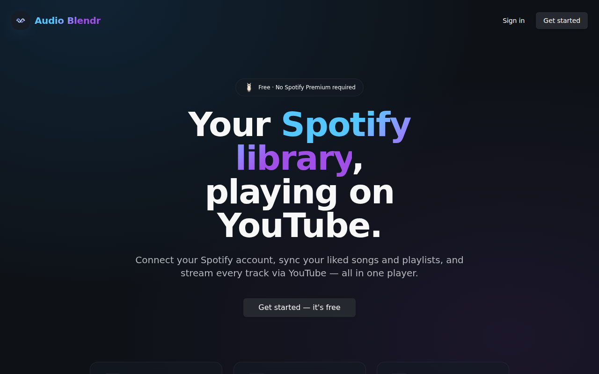
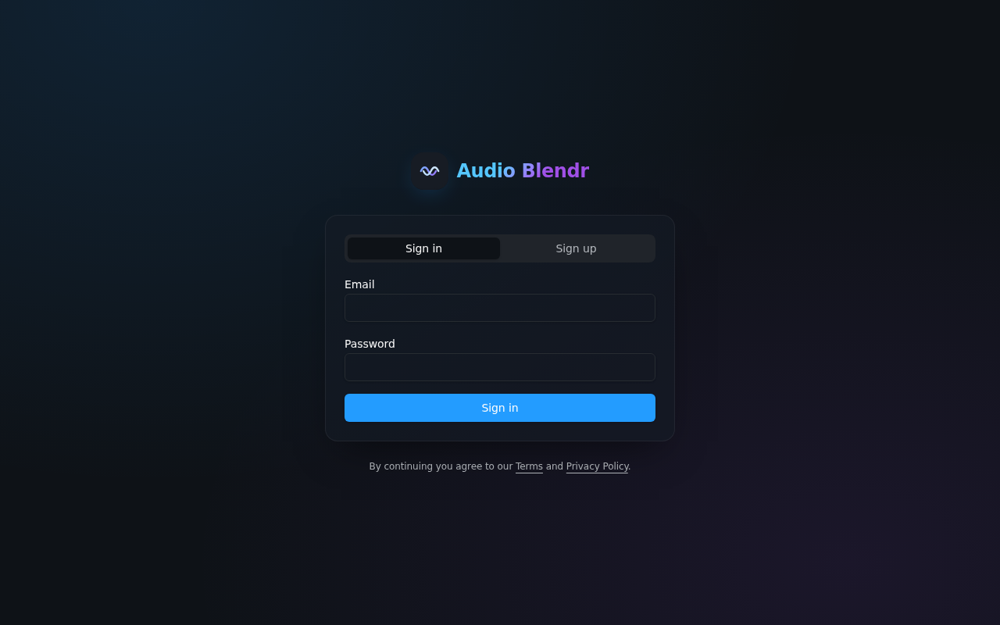
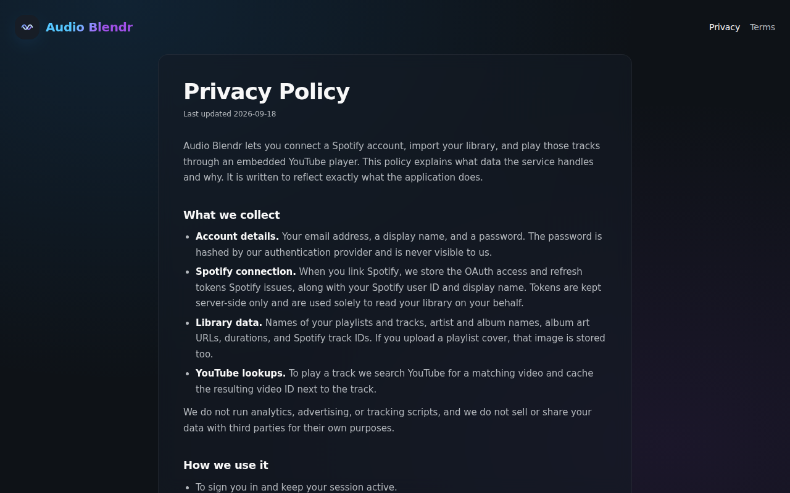

<div align="center">

# Audio Blendr

**Your Spotify library, playing on YouTube.**

Connect Spotify, sync your liked songs and playlists, and stream every track through an embedded YouTube player — no Spotify Premium required.

[](https://github.com/dsyang1219/audio-blendr/actions/workflows/ci.yml)
[](LICENSE)


[Live demo](https://audio-blendr.danielleyang1219.workers.dev) · [Report a bug](https://github.com/dsyang1219/audio-blendr/issues)

</div>

---

## Screenshots

|                    Landing                    |                  Sign in                   |
| :-------------------------------------------: | :----------------------------------------: |
|  |  |

|                     Storage notice                      |                 Privacy policy                  |
| :-----------------------------------------------------: | :---------------------------------------------: |
|  |  |

> Library, playlist and player views require a signed-in account with a linked Spotify — add your own captures to `docs/screenshots/` and reference them here.

## Features

- **Spotify OAuth** — link a Spotify account with a signed, expiring `state` parameter (HMAC-SHA256) so the callback can safely trust the user it belongs to.
- **Library sync** — import liked songs and playlists as metadata; nothing is downloaded or re-hosted.
- **Lazy YouTube resolution** — each track is matched to a YouTube video the first time it's played (with a ladder of fallback queries) and the result is cached on the row. This keeps the app inside the YouTube Data API's 10,000-unit daily quota.
- **Unified player** — persistent bottom player with queue, shuffle, volume, prefetch of the next track, and a hidden privacy-enhanced (`youtube-nocookie.com`) embed.
- **Playlist management** — create, rename, reorder (drag-and-drop), upload cover art, and add tracks from Spotify search or existing library.
- **Multi-tenant by construction** — every table has row-level security; server functions run with the caller's JWT so a bug in application code can't leak another user's rows.
- **Compliance basics** — privacy policy, terms of service, and a storage/cookie notice.

## Architecture

```
Browser (React 19 + TanStack Router)
  │
  │  server functions (typed RPC, Bearer JWT forwarded by middleware)
  ▼
TanStack Start on Cloudflare Workers
  ├─ requireServerFnAuth  → verifies JWT, builds an RLS-scoped Supabase client
  ├─ spotify.functions    → OAuth, token refresh, library/playlist sync
  ├─ youtube.functions    → lazy video resolution, batch resolve
  └─ /api/spotify/callback → exchanges the code, persists tokens (service role)
  │
  ▼
Supabase (Postgres + Auth + Storage)          Spotify Web API      YouTube Data API v3
  profiles · spotify_connections · liked_tracks
  playlists · playlist_tracks · user_roles
```

**Why these choices**

| Decision                                                                                | Reasoning                                                                                                                                                                     |
| --------------------------------------------------------------------------------------- | ----------------------------------------------------------------------------------------------------------------------------------------------------------------------------- |
| TanStack Start server functions instead of a separate REST API                          | End-to-end types, no client/server drift, and the auth middleware attaches the user's JWT to every call automatically.                                                        |
| RLS-scoped client in server functions, service-role client _only_ in the OAuth callback | Keeps the blast radius small: application code physically cannot read another user's rows even if a query is wrong.                                                           |
| HMAC-signed OAuth `state`                                                               | The callback writes tokens with elevated privileges, so it must be able to trust `state.userId`. An unsigned state would let anyone bind their Spotify to a victim's account. |
| Resolve YouTube IDs lazily on first play                                                | `search.list` costs 100 quota units. Resolving a 2,000-track library up front would burn 20 days of quota.                                                                    |
| Web Crypto (not `node:crypto`) for signing                                              | Runs identically on Node during tests and on the Cloudflare Workers runtime in production.                                                                                    |

## Tech stack

**Frontend** React 19 · TypeScript (strict) · TanStack Router & Query · Tailwind CSS v4 · shadcn/ui (Radix) · dnd-kit · react-youtube
**Backend** TanStack Start · Cloudflare Workers · Supabase (Postgres, Auth, Storage, RLS)
**Tooling** Vite 7 · Vitest · ESLint 9 · Prettier · GitHub Actions · Bun

## Getting started

### Prerequisites

- [Bun](https://bun.sh) ≥ 1.1 (or Node ≥ 22 with npm)
- A [Supabase](https://supabase.com) project
- A [Spotify developer app](https://developer.spotify.com/dashboard)
- A [YouTube Data API v3](https://console.cloud.google.com/apis/library/youtube.googleapis.com) key

### 1. Clone and install

```bash
git clone https://github.com/dsyang1219/audio-blendr.git
cd audio-blendr
bun install
```

### 2. Configure environment

```bash
cp .env.example .env
```

Fill in every value. `.env.example` documents each variable, which ones are public, and where to find them.

### 3. Set up the database

Apply the migrations in `supabase/migrations/` to your project, in filename order. With the [Supabase CLI](https://supabase.com/docs/guides/cli):

```bash
supabase link --project-ref <your-project-ref>
supabase db push
```

This creates every table, index, RLS policy, the `playlist-covers` storage bucket, and a trigger that provisions a profile + default role on signup.

### 4. Register the Spotify redirect URI

In the Spotify dashboard, add exactly:

```
<SPOTIFY_APP_ORIGIN>/api/spotify/callback
```

For local development that's `http://localhost:8080/api/spotify/callback`.

### 5. Run

```bash
bun run dev          # http://localhost:8080
```

## Scripts

| Command                           | What it does                                      |
| --------------------------------- | ------------------------------------------------- |
| `bun run dev`                     | Start the dev server with HMR on port 8080        |
| `bun run build`                   | Production build for Cloudflare Workers (`dist/`) |
| `bun run preview`                 | Serve the production build locally                |
| `bun run typecheck`               | `tsc --noEmit`                                    |
| `bun run lint`                    | ESLint (includes Prettier rules)                  |
| `bun run format` / `format:check` | Prettier write / verify                           |
| `bun run test` / `test:watch`     | Vitest unit tests                                 |

CI runs typecheck, lint, format check, tests and a production build on every push and pull request.

## Testing

Unit tests live next to the code they cover in `src/**/__tests__/` and target the pure, security-relevant logic:

- **`spotify-auth`** — signed state round-trips, tamper/forgery rejection, expiry, secret rotation, and the open-redirect guard on return origins.
- **`youtube.server`** — ISO-8601 duration parsing, title cleaning, and the query fallback ladder.

```bash
bun run test
```

## Deployment

The app is a single Cloudflare Worker (free tier is plenty). The build is configured by `@cloudflare/vite-plugin` and `wrangler.jsonc`; no Lovable, Vercel or other platform-specific runtime is involved.

### One-time setup

1. Create a free [Cloudflare account](https://dash.cloudflare.com/sign-up) and note your **Account ID** (Workers & Pages → Overview).
2. Authenticate locally:
   ```bash
   npx wrangler login
   ```
3. Set the server-side secrets on the Worker (you'll be prompted for each value):
   ```bash
   for name in SUPABASE_URL SUPABASE_PUBLISHABLE_KEY SUPABASE_SERVICE_ROLE_KEY \
               SPOTIFY_CLIENT_ID SPOTIFY_CLIENT_SECRET SPOTIFY_STATE_SECRET \
               SPOTIFY_APP_ORIGIN YOUTUBE_API_KEY; do
     npx wrangler secret put "$name"
   done
   ```
   `SPOTIFY_APP_ORIGIN` is your production origin, e.g. `https://audio-blendr.<subdomain>.workers.dev` or a custom domain.
4. In the Spotify dashboard add `<SPOTIFY_APP_ORIGIN>/api/spotify/callback` as a redirect URI.
5. In Supabase → Authentication → URL Configuration, add the same origin to **Redirect URLs**.

### Deploy

```bash
bun run deploy       # = vite build && wrangler deploy
```

The first deploy prints your `*.workers.dev` URL. To use your own domain, add it under the Worker's **Settings → Domains & Routes**.

### Continuous deployment

`.github/workflows/deploy.yml` deploys automatically on every push to `main`. Add these to the GitHub repository:

| Kind     | Name                            | Value                                                       |
| -------- | ------------------------------- | ----------------------------------------------------------- |
| Secret   | `CLOUDFLARE_API_TOKEN`          | Token created from the **Edit Cloudflare Workers** template |
| Secret   | `CLOUDFLARE_ACCOUNT_ID`         | Your account ID                                             |
| Variable | `VITE_SUPABASE_URL`             | Supabase project URL                                        |
| Variable | `VITE_SUPABASE_PUBLISHABLE_KEY` | Supabase anon/publishable key                               |
| Variable | `VITE_CONTACT_EMAIL`            | Address shown on the legal pages                            |

## Security notes

- Spotify tokens are stored server-side and only ever handled by server functions. The browser never sees them.
- The OAuth `state` is signed and expires after 10 minutes; the callback rejects anything unsigned, tampered, or stale.
- Return origins after OAuth are collapsed to an allowlist (`SPOTIFY_APP_ORIGIN` + `SPOTIFY_ALLOWED_RETURN_ORIGINS`) to prevent open redirects.
- The service-role key is used in exactly one place (`/api/spotify/callback`) and nowhere in application code.
- `.env` is git-ignored. Publishable Supabase keys are safe to expose; everything else in `.env.example` marked SECRET must never be committed.

## Roadmap

- [ ] Self-service account deletion from Settings
- [ ] Persist play history and surface "recently played"
- [ ] Offline queue / PWA install
- [ ] Import from a YouTube Music library as a second source

## License

[MIT](LICENSE) © Danielle Yang

Audio Blendr is not affiliated with, endorsed by, or sponsored by Spotify or YouTube.
